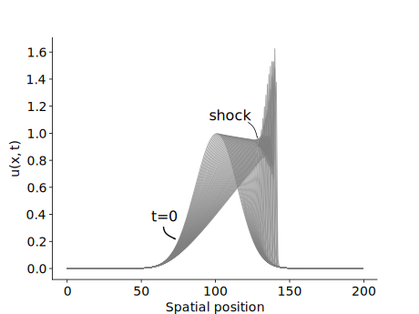

# Burger's Equation

The Burger's equation is given given by

The implicit Euler discretized form is given by

*n* denotes the time step, and *i* denotes the spatial position. At each time step a non-linear
system of equations needs to be solved for the unknown <i>uin+1</i>.
In the example file *main.go* this is done by using *NewtonKrylov* method. The solution is shown 
below.

After a certain time a shock develops.